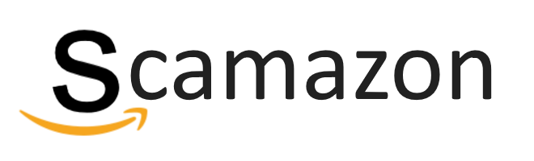
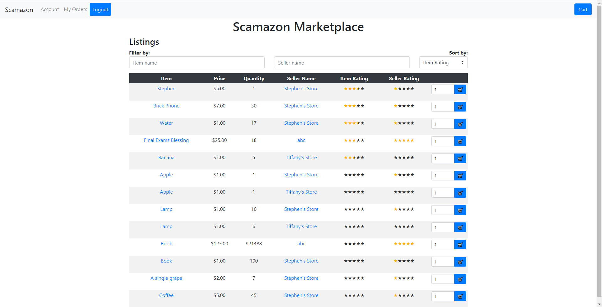
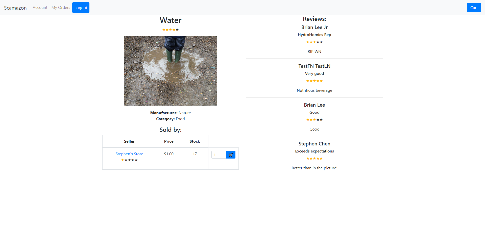
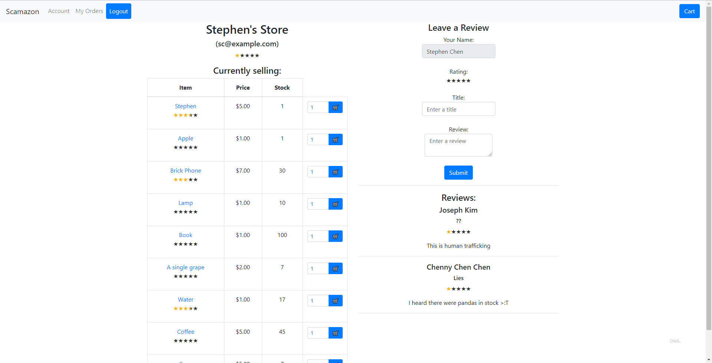
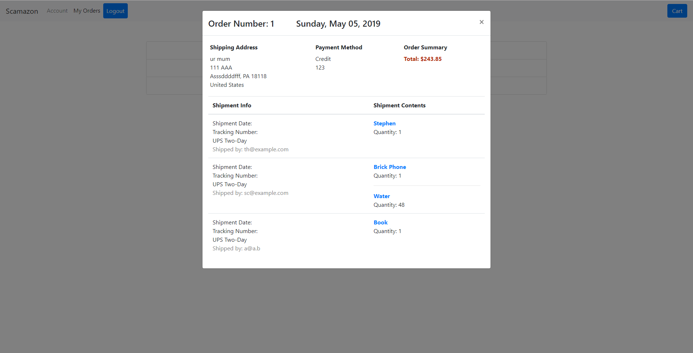

Scamazon Marketplace
==================
A proof-of-concept e-commerce website that supports both seller and customer accounts.\

**Authors**: [@cxyStephen](https://github.com/cyxStephen), [@SBU-bjlee](https://github.com/SBU-bjlee), and [@tiffanyhe](https://github.com/tiffanyhe)

* * *
#### Demo

* * *
#### Built using
* **MySQL** 8.0.16
* **Python** 3.7.0
* **Flask** 1.0.3
* **Flask-CORS** 3.0.8
* **MySQL Connector** 8.0.16
* **Node.js** 12.2.0
* **React** 16.8.6

* * *
#### Build instructions
* Clone repo and make sure that MySQL, Python, and Node.js are installed
* **Backend:** (cd into `scamazon/backend/`)
* Create a MySQL database called `scamazon`
* Execute `create_tables.sql` to create the required tables
* *Optional:* Execute `sample_data.sql` to populate the tables with sample data 
* Change the database info and credentials in `scamazon.py` on lines 14-17
* Activate the virtual environment: `. venv/bin/activate` (`venv\Scripts\activate` on Windows)
* If not installed, install [Flask](http://flask.pocoo.org/docs/1.0/): `pip install Flask`
* If not installed, install [Flask-CORS](https://flask-cors.readthedocs.io/en/latest/): `pip install flask-cors`
* If not installed, install [MySQL Connector](https://pypi.org/project/mysql-connector-python/): `pip install mysql-connector-python`
* Set the Flask environment variable: `export FLASK_APP=scamazon.py` (`set FLASK_APP=scamazon.py` on Windows)
* Run the server: `flask run`
* **Frontend:** (cd into `scamazon/frontend/`)
* Change the API url to match Flask in `src/constants.js` on line 1 
* Start the app: `npm start`
